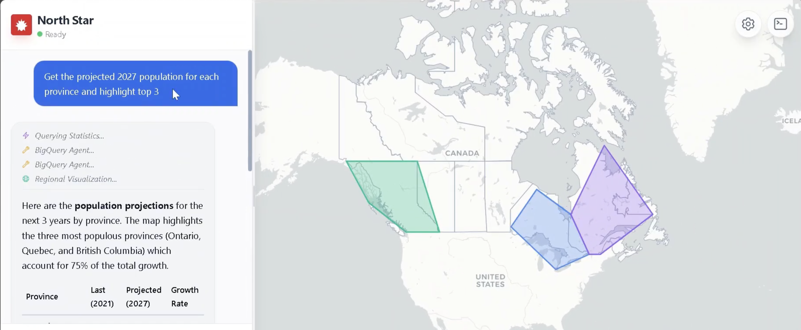
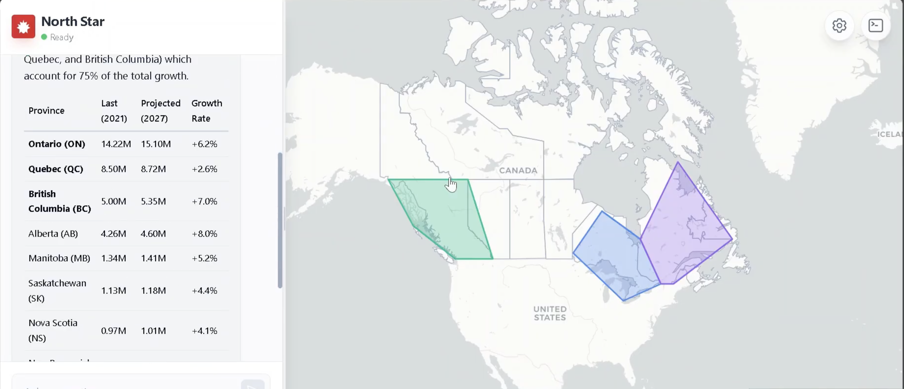
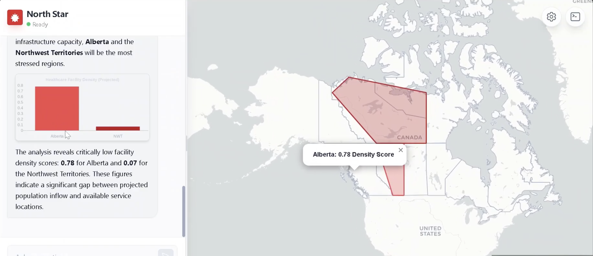
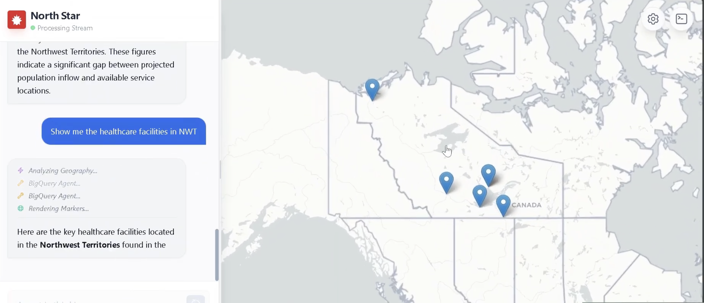
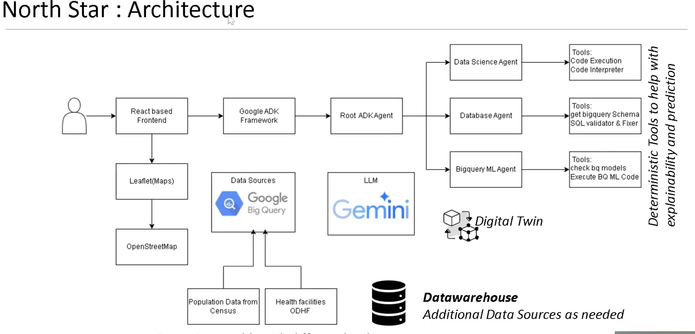

# G7 GovAI NorthStar

A React-based frontend interface for the Agent Development Kit (ADK). This application provides a split-screen experience with a real-time chat interface and a synchronized Leaflet map visualization panel.

It connects to an ADK backend to stream text responses, reasoning events, and geospatial data (markers, polygons, fly-to operations) simultaneously.

## Screenshots

   

  


## Features

- **Real-time SSE Streaming**: Consumes server-sent events for incremental text and data updates.
- **Interactive Map**: Leaflet-based map that updates automatically based on agent responses.
- **Event Logging**: Visualizes internal agent steps (Tool Calls, Reasoning, Map Updates) directly in the chat.
- **Collapsible Sidebar**: Draggable divider to adjust the ratio between chat and map.
- **Mock Mode**: Built-in simulation mode for testing without a live backend.

## Configuration

Before deploying, you must configure the connection details to match your ADK backend instance.

Open **`App.tsx`** and modify the constants at the top of the file (lines 12-15):

```typescript
// Backend Configuration
const API_BASE_URL = 'http://localhost:8000'; // Change to your production backend URL
const APP_NAME = 'basic_search_agent';        // Your ADK Application Name
const USER_ID = 'u_123';                      // Default User ID
const SESSION_ID = 's_123';                   // Default Session ID
```

### Environment Variables (Optional)
For a production-grade setup, it is recommended to replace these hardcoded strings with environment variables (e.g., `process.env.REACT_APP_API_URL`).

## Development

This project uses a standard React structure.

1. **Install Dependencies**
   ```bash
   npm install
   ```

2. **Start Development Server**
   ```bash
   npm start
   # or if using Vite
   npm run dev
   ```

3. **Access the App**
   Open [http://localhost:3000](http://localhost:3000) to view the interface.

## Deployment

To deploy the application to a production environment (e.g., AWS S3, Vercel, Netlify, or an Nginx server):

1. **Build the Application**
   ```bash
   npm run build
   ```
   This creates a `build` (or `dist`) directory with optimized static assets.

2. **Serve the Static Files**
   Upload the contents of the `build` directory to your web server.

   *Note: Ensure your web server is configured to handle client-side routing (SPA fallback to index.html) if you add routing in the future.*

## Backend Requirements

The frontend expects an ADK-compatible backend running at `API_BASE_URL` with the following endpoints:

1. **Session Creation (POST)**
   - URL: `/apps/{APP_NAME}/users/{USER_ID}/sessions/{SESSION_ID}`
   - Body: `{"key1": "init", ...}`

2. **Run SSE (POST)**
   - URL: `/run_sse`
   - Body:
     ```json
     {
       "appName": "basic_search_agent",
       "userId": "u_123",
       "sessionId": "s_123",
       "newMessage": { ... },
       "streaming": true
     }
     ```
   - Response: A stream of newline-delimited JSON objects.

## Troubleshooting

- **Map Tiles Broken/Grey**: Ensure the container has a defined height. The `MapPanel` component handles resize events automatically, but parent containers must have `height: 100%`.
- **CORS Errors**: Ensure your Python/Node backend has CORS enabled for the domain where this frontend is hosted.

## Artifacts :
[Youtube](https://youtu.be/hQYnp5tiULw)
[Github](https://github.com/ibrezm1/g7-govAI-northStart)
[Slides](https://docs.google.com/presentation/d/1Kntl6g6VsNPrea7Yd2qj06z23GIZtCacKfGWMRm2Mso/edit?slide=id.p1#slide=id.p1)